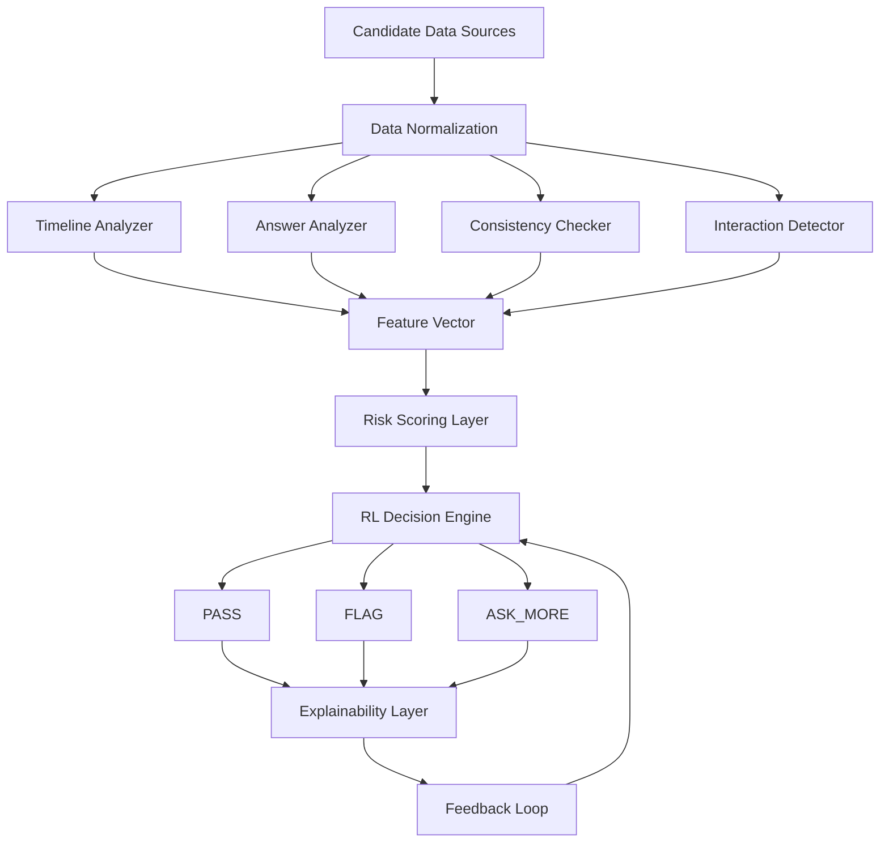

# Expertise Fraud Detection System

A comprehensive proof-of-concept for detecting potential expertise fraud in candidate profiles using machine learning, reinforcement learning, and workflow orchestration. This system analyzes profile histories, screening answers, and web signals to identify suspicious claims, providing explainable decisions for hiring processes.



## 🎯 What This Project Demonstrates

This implementation showcases a balanced approach to fraud detection that prioritizes **interpretability and practicality** over complex models. Key highlights:

- **Strong Feature Engineering**: Rule-based extraction of anomaly scores from text patterns (e.g., buzzwords, timeline inconsistencies).
- **Reinforcement Learning**: PPO-trained policy for optimal decision-making (PASS, FLAG, ASK_MORE) in a Gymnasium environment.
- **Explainable AI**: Transparent evidence lists and risk scores for every decision.
- **Synthetic Data**: Realistic fraud/non-fraud profiles for training and testing.
- **Workflow Orchestration**: LangGraph state machine for structured processing.
- **Interactive UI**: Streamlit app for inspecting candidates and decisions.

The strongest submissions aren't giant models—they're thoughtful engineering with clear logic, as demonstrated here.

## 🏗️ Architecture Overview

The system follows a modular pipeline:

1. **Data Generation** (`synthetic_data.py`): Creates labeled candidate profiles with fraud indicators.
2. **Feature Extraction** (`feature_engineering.py`): Computes anomaly scores from profile text, answers, and web signals.
3. **Decision Policy** (`agent.py`): Heuristic or RL-based action selection (PASS/FLAG/ASK_MORE).
4. **RL Training** (`train_rl.py`): Trains PPO model in Gymnasium environment.
5. **Evaluation** (`evaluate.py`): Metrics and confusion matrix on test data.
6. **UI & Workflow** (`streamlit_app.py`, `graph.py`): Interactive demo and LangGraph orchestration.

### Key Components

- **Anomaly Detection**: Four dimensions (timeline, answer quality, consistency, web signals) weighted into a risk score.
- **RL Environment** (`env.py`): Multi-step decision process with rewards for accurate flagging.
- **LangGraph Workflow**: Stateful graph for feature extraction → decision → output.
- **Synthetic Data**: Fraud patterns (e.g., rapid promotions, buzzwords) vs. legitimate profiles.

## 📦 Installation

### Prerequisites

- Python 3.8+
- Virtual environment (recommended)

### Setup

```bash
# Clone or navigate to the project directory
cd expertise-fraud-detector

# Create and activate virtual environment
python -m venv .venv
.venv\Scripts\activate  # Windows
# source .venv/bin/activate  # macOS/Linux

# Install dependencies
pip install -r requirements.txt
```

### Dependencies

- **LangChain/LangGraph**: Workflow orchestration and potential LLM integration.
- **Stable-Baselines3/Gymnasium**: RL training and environment.
- **Pydantic**: Data validation and schemas.
- **Streamlit**: Web UI.
- **Scikit-learn/Pandas/NumPy**: Data handling and metrics.
- **Matplotlib/Seaborn**: Visualization (optional).

## 🚀 Usage

### Run the Interactive Demo

Launch the Streamlit app to explore candidates:

```bash
python -m streamlit run app/streamlit_app.py
```

- Browse synthetic candidates (slide the index).
- View extracted features, risk scores, and decisions.
- Inspect LangGraph workflow output.
- Test with the built-in fraud example (`FRAUD_TEST_001`).

### Train the RL Policy

Train a PPO model on synthetic data:

```bash
python -m app.train_rl
```

- Default: 20,000 timesteps, 500 samples.
- Model saved to `artifacts/fraud_ppo.zip`.
- Customize: Edit `train_rl.py` for timesteps/samples.

### Evaluate Performance

Run metrics on test data:

```bash
python -m app.evaluate
```

- Outputs confusion matrix, precision/recall, and average reward.
- Uses trained PPO model if available; falls back to heuristic.

### Command-Line Demo

Quick JSON output for a candidate:

```bash
python -m app.main --candidate 0
```

## 📁 Project Structure

```
expertise-fraud-detector/
├── README.md                 # This file
├── requirements.txt          # Python dependencies
├── app/                      # Main application code
│   ├── __init__.py
│   ├── agent.py              # Decision policies (heuristic/RL)
│   ├── env.py                # Gymnasium RL environment
│   ├── evaluate.py           # Performance metrics
│   ├── feature_engineering.py # Anomaly score extraction
│   ├── graph.py              # LangGraph workflow
│   ├── main.py               # CLI demo
│   ├── prompts.py            # LLM prompts (placeholder)
│   ├── schemas.py            # Pydantic models
│   ├── streamlit_app.py      # Web UI
│   ├── synthetic_data.py     # Data generation
│   ├── train_rl.py           # RL training script
│   ├── utils.py              # Helpers (seeding, I/O)
│   └── __pycache__/          # Python cache
├── notebooks/                # Jupyter exploration
│   └── exploration.ipynb
├── tests/                    # Unit tests
│   ├── test_env.py
│   ├── test_features.py
│   └── __pycache__/
└── artifacts/                # Outputs (created on run)
    ├── fraud_ppo.zip         # Trained RL model
    ├── train_config.json     # Training metadata
    └── eval_metrics.json     # Evaluation results
```

## 🔍 How It Works

### Feature Engineering

The system extracts four anomaly scores (0-1 scale) from candidate data:

- **Timeline Anomaly**: Detects implausible career jumps (e.g., "intern to head in 2 months").
- **Answer Anomaly**: Flags verbose, buzzword-heavy responses lacking detail.
- **Consistency Anomaly**: Identifies mismatches between claims and specifics.
- **Web Anomaly**: Evaluates public signals for sparsity or repetition.

Weighted risk score: `0.35*timeline + 0.30*answer + 0.20*consistency + 0.15*web`.

### Decision Logic

- **Heuristic Policy**: Threshold-based (e.g., risk > 0.4 → FLAG).
- **RL Policy**: PPO model learns optimal actions via rewards (accurate flagging = +points, false positives = penalties).

### RL Environment

- **State**: 4D anomaly vector.
- **Actions**: 0=PASS, 1=FLAG, 2=ASK_MORE.
- **Rewards**: +3 for correct FLAG, +1 for correct PASS, -5 for false positives, -0.2 for ASK_MORE.
- **Episodes**: Multi-step (up to 5 ASK_MORE) with termination on PASS/FLAG.

### Synthetic Data

- **Fraud Profiles**: Rapid promotions, generic buzzwords, inconsistent signals.
- **Legitimate Profiles**: Specific projects, tradeoffs, consistent timelines.
- **Labels**: 0=legitimate, 1=fraud (for supervised evaluation).

### LangGraph Workflow

Simple state machine:

- Extract features → Compute risk → Decide action → Output.

## 📊 Example Output

For a fraudulent candidate (`FRAUD_TEST_001`):

- **Profile**: "Intern to head of AI in 2 months using state of the art scalable optimized robust transformative best practices."
- **Anomalies**: Timeline=0.9, Answer=0.25, Consistency=0.1, Web=0.0
- **Risk Score**: 0.41
- **Decision**: FLAG
- **Evidence**: Implausible jump, compressed timeline, senior title without tenure, etc.

## 🧪 Testing

Run unit tests:

```bash
pytest tests/
```

- `test_env.py`: Environment stepping.
- `test_features.py`: Feature extraction.

## 📝 Notes and Limitations

- **Synthetic Data**: No real labeled dataset provided, so patterns are curated but not exhaustive.
- **Heuristic Baseline**: Rule-based policy serves as interpretable fallback.
- **Scalability**: Designed for PoC; production would need real data, hyperparameter tuning, and model validation.
- **Explainability**: Evidence lists make decisions auditable, unlike black-box models.
- **Extensibility**: Easy to add LLM-based features or real data loaders.

## 🤝 Contributing

1. Fork the repo.
2. Create a feature branch.
3. Add tests for changes.
4. Submit a PR with description.

## 📄 License

This project is for educational/demonstration purposes. Use at your own risk.

## 🙏 Acknowledgments

Built with LangChain, Stable-Baselines3, Gymnasium, and Streamlit. Inspired by real-world hiring challenges.
